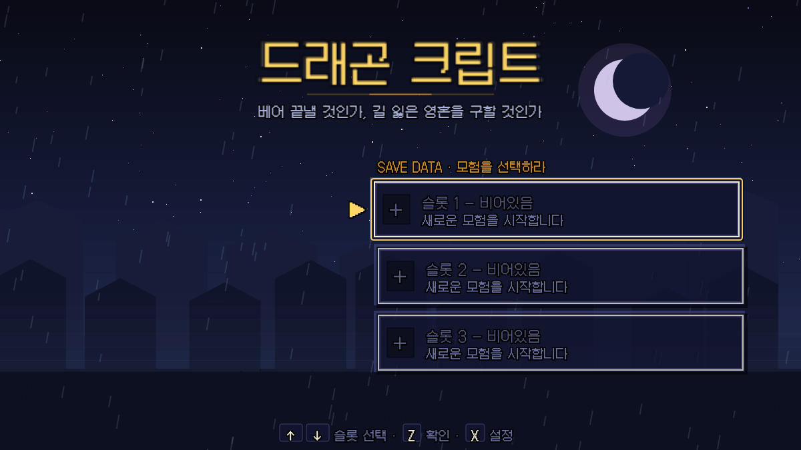
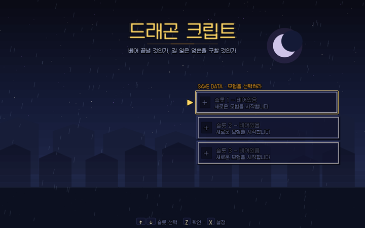

# dungeon-craft

[한국어](README.md) | **English**

A Dragon Quest-inspired turn-based JRPG built with plain JavaScript and PixiJS.

Weakened enemies can be defeated, spared, or in some cases recruited. The accumulated choices appear through changes in NPC dialogue, party relationships, boss routes, and the ending rather than a visible score.



## Project highlights

- **Combat choices carry forward**: defeating or sparing an enemy changes later dialogue and progression routes.
- **Rendering is separate from combat rules**: battle resolution does not depend on PixiJS and can run repeatedly in Node.
- **Headless balance checks**: automated combat passes compare average rounds and death counts across different builds.
- **Map connectivity tests**: portal and collision data are checked as a graph to catch unreachable areas.

> Sister project: `../game` (Crypt Survivors — a Vampire Survivors–style auto-battler).
> We share heroes, assets, and world, but the architecture is completely different.

## Screenshot



## Running the game

```bash
npm install
npm run dev      # dev server at http://localhost:9153/
npm test         # Vitest unit tests
npm run build    # production bundle → dist/
npm run balance  # headless battle harness (see below)
```

### Balance harness

`npm run balance` simulates combat without the renderer, running 3 passes.

| Pass | Condition | What we measure |
|---|---|---|
| BASELINE | Kill build, no bonds | avgRounds / deaths |
| MERCY | Positive bonds (tanky + clutch FP) | survivability gain |
| RUTHLESS | Negative bonds (glass cannon, no HP cushion) | damage gain |

Win% saturates under optimal AI, so we focus on **average rounds and death count**.

## Project structure

```
src/
  engine/    sceneManager (LIFO scene stack) · renderer (only PixiJS consumer) · input
  systems/   battle (pure resolver — no Pixi) · progression (xp/level/unit builders)
             field (grid movement + encounters) · roamers (overworld patrol) · bonds (pure)
  content/   spells · monsters · items · party · dialog (includes tone-branch variants)
             quests · questlines · bondSkills · maps/ (town/wild/dungeon/frost/swamp +
             4 empire maps + lava·void post-game superbosses, via _builder + index)
  scenes/    title · field · battle(opaque) · dialog(overlay) · menu · shop · equip · warp
  fx/        spellFx.js — code-drawn pixel spell FX engine (~76 choreographies)
  ui/        uikit.js — windowBox / menuList / label (the only UI primitives)
  util/      rng (seeded) · audio (ZzFX + asset SFX/BGM layer) · assets (sprite URL bridges)
  data/      save.js (localStorage with defensive `??` validation) · settings.js
main.js      bootstrap — wires engine + scenes + runtime, owns save fold, prologue gating,
             recruit persistence, mercy-counter fold, ending-tone routing
scripts/balance.js   headless battle harness
```

## Core design patterns

For details, see **[docs/ARCHITECTURE.md](docs/ARCHITECTURE.md)**. In brief:

1. **Pure battle resolver** — `systems/battle.js` doesn't import PixiJS and never writes save.
   `resolveAction(state, action, rng)` mutates state and returns `{ events }`; the scene reads events to animate.
2. **LIFO scene stack** — only the top scene gets `update(dt)`, and the whole stack renders. Scenes never import each other.
3. **Mercy mechanic** — enemies at `hp ≤ maxHp × 0.3` can be spared or recruited. Pure predicates `canMercy` / `canRecruit` gate the UI.
4. **Tone-branched dialogue** — mercy ratio generates `merciful / ruthless / mixed` tones, and `${id}_${tone}` variants swap in automatically. **The ratio is never shown as a meter** (Undertale-style).
5. **Fabula Points + Bonds** — a Fabula Ultima adaptation: "mercy = power." Positive bonds give tank + clutch, negative bonds give offense only (glass cannon, no HP cushion).
6. **Map connectivity tests** — portal graph + baked collision + BFS regression tests lock "can't clear one wall blocking a region" bugs.

## Documentation

| Document | Purpose |
|---|---|
| [docs/ARCHITECTURE.md](docs/ARCHITECTURE.md) | architecture details |
| [CLAUDE.md](CLAUDE.md) | dev rules + content-extension checklist + known gotchas (883 lines, essentially a dev manual) |
| [DESIGN.md](DESIGN.md) | UI vocabulary |
| [TODOS.md](TODOS.md) | deferred scope |
| [docs/map-roadmap.md](docs/map-roadmap.md) | map work roadmap |

## License

**Source-available — not open source.** We've published the code to read, but haven't granted permission to use it. If you want to use it in another project, redistribute it, or build commercial products from it, you'll need written permission first. Full license in [LICENSE](LICENSE); Korean summary in [LICENSE.ko.md](LICENSE.ko.md).

Sound effects are from [ZzFX](https://github.com/KilledByAPixel/ZzFX) (MIT); pixel art was partly generated with PixelLab. Third-party components follow their own licenses.
