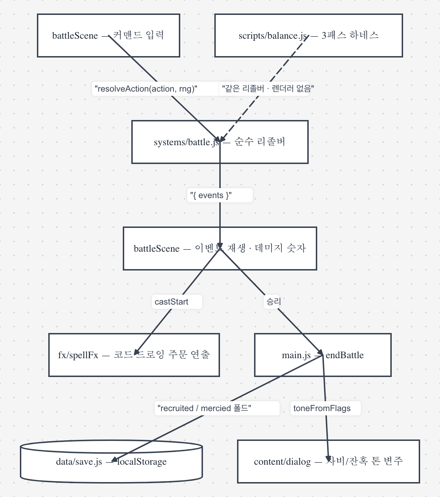

# 던전크래프트 — 아키텍처

> 이 문서는 "왜 이렇게 나뉘어 있는가"를 설명합니다.
> 콘텐츠를 추가할 때 밟아야 할 절차와 함정 목록은 [`../CLAUDE.md`](../CLAUDE.md)에 있습니다.

---

## 0. 한 줄 요약

**시뮬레이션과 렌더링이 분리되어 있습니다.** 전투 리졸버는 순수 함수이고 PixiJS를
전혀 모릅니다. 그래서 게임 전체가 Node에서 헤드리스로 돌아가고, 밸런스를
브라우저 없이 수천 판 돌려볼 수 있습니다.

```
                   ┌──────────────────────────────┐
   입력 ──────────▶│ scenes/  (씬 = 표현 계층)      │
                   │  battle / field / dialog …    │
                   └───────┬──────────────▲───────┘
                           │ action        │ events
                           ▼               │
                   ┌──────────────────────────────┐
                   │ systems/battle.js            │  ← 순수. Pixi 미참조.
                   │ resolveAction(state, a, rng) │     세이브도 안 씀.
                   └──────────────────────────────┘
                           ▲
                           │ 데이터만
                   ┌──────────────────────────────┐
                   │ content/  (spells, monsters, │
                   │  items, party, maps, dialog) │
                   └──────────────────────────────┘
```

`scripts/balance.js`는 위 그림에서 **씬 계층만 걷어내고** 같은 리졸버를 그대로 돌립니다.

전투 한 판의 이벤트 플로우를 펼치면 이렇습니다 — 리졸버는 이벤트만 돌려주고,
연출·저장·톤 분기는 전부 바깥 계층의 일입니다:



> 이 다이어그램은 [pig-ma](https://github.com/gook-lab/pig-ma)의 Mermaid
> import로 그렸습니다. 원본 정의는
> [`diagrams/battle-event-flow.mmd`](diagrams/battle-event-flow.mmd) —
> 구조가 바뀌면 이 파일을 다시 import 해서 갱신합니다.

---

## 1. 씬 스택 (`engine/sceneManager.js`)

LIFO 스택. **최상단 씬만 `update(dt)`를 받고, 스택 전체가 렌더됩니다.**

- `opaque: true` 인 씬(Battle, Title)은 아래를 가립니다.
- 나머지(Dialog, Menu, Shop)는 필드 위 오버레이로 겹칩니다.
- **씬은 서로를 import하지 않습니다.** 전환은 `game.toX()` 또는 `game.scenes.push`로만 합니다.
- 현재 씬은 `game.scenes.top`입니다.

이 규칙 덕분에 "대화창을 띄운 채 필드가 그대로 보이는" 연출이 특수 처리 없이 나옵니다.

---

## 2. 순수 전투 리졸버 (`systems/battle.js`)

```js
const state = createBattle(heroUnits, enemyUnits)
const { events } = resolveAction(state, action, rng)   // state를 변형하고 이벤트 반환
```

씬은 `events`를 읽어 애니메이션만 재생합니다. 리졸버는 **PixiJS를 import하지 않고,
세이브를 안 씁니다.**

### 턴 순서 — 진영별이 아니라 speed 인터리브

살아있는 전 유닛을 하나의 트랙에 놓고 spd 내림차순 정렬합니다(동점은 히어로 우선,
그다음 인덱스 안정 정렬). 진영이 번갈아 도는 방식이 아니기 때문에 **빠른 잡몹이 느린
아군보다 먼저 움직입니다.** `effectiveSpd`를 통해 동상/빙결이 슬롯 자체를 늦춉니다.

### 액션과 주문

- 액션: `attack | spell | item | defend | flee | mercy`
- 주문 `kind`: `damage | heal | mana | buff | ailment | cure | state`
- 데미지 주문은 두 갈래:
  - **마법**(기본) — `magicDamage`, maxMp 스케일, 방어 무시
  - **물리**(`physical: true`) — `skillDamage`, atk 스케일, 방어 적용
    (`melee` 분노 보너스 / `hits` 다단히트 / `pierce` 방어 무시 / `critBonus`)

### 전투 상태 (4클래스 체계)

리졸버 안에서만 해석되는 순수 유닛 필드입니다.

| 상태 | 클래스 | 효과 |
|---|---|---|
| `stealth` 은신 | 헌트리스 | 다음 피해 스킬 확정 크리 ×1.8 + 행동 전까지 회피. 사용 시 소모 |
| `rage` 분노 | 워리어 | N턴간 근접 피해 +30%, 흡혈 +30% (`hpCost`로 진입) |
| `charge` 충전 | 메이지 | 다음 **마법** 주문 ×1.5. 사용 시 소모 |
| `shield` 방어막 | 공용 | 흡수 풀. `dealDamage`에서 먼저 깎인다 |
| `evaTurns` | 공용 | 연막탄 회피 |
| `aggro` 도발 | 공용 | `enemyChooseAction`이 도발자를 노린다 |

클래스 정체성: **나이트** = 성속 서포트(전체 힐/해제/배리어) · **워리어** = 근접/분노 ·
**헌트리스** = 물리 원거리/암살 · **메이지** = 비전 + 원소 캐스터(선택 영입).

### 유닛 생성 경로는 하나

`makeUnit(over)`가 공통 유닛 형태를 만듭니다. `buildEnemyUnit`(battle.js),
`buildHeroUnit`/`buildAllyUnit`(progression.js)이 전부 이걸 거칩니다.

> **의존 방향 규칙**: `progression.js` → `battle.js` (단방향).
> battle.js는 progression.js를 import하지 않는다. **뒤집지 말 것.**

---

## 3. 자비 메커니즘 — 처치 / 스페어 / 영입 분기

`hp ≤ maxHp × mercyThreshold`(기본 0.3)인 적은 **살려보내기(spare)** 또는
**영입(recruit)** 대상이 됩니다. 순수 술어 `canMercy(t)` / `canRecruit(t)`가 UI를 게이트합니다.

**보스의 옵트인**: 스토리 보스도 `boss: true`(격노·보스 음악·지역 게이팅 유지)를
지킨 채 `spareable: true`로 자비 대상이 될 수 있습니다. 게이트는
`(!target.boss || target.spareable)`을 읽기 때문에 **표시한 보스만** 대상이 됩니다.
`recruitable`은 명시 오버라이드를 존중해서, 자비 가능 보스가 동료가 될 수도 있습니다.
(참조 구현: `bog_witch` 늪의 마녀 — 자비/처단 갈림길)

---

## 4. 톤 분기 서사

### 4.1 자비 톤 (`content/dialog.js`)

```
toneFromFlags(flags) → merciful (자비 ≥70%) / ruthless (≤30%) / mixed (해결 4건 미만)
tonedDialogId(id, flags) → `${id}_${tone}` 변형이 있으면 교체
```

**자비 비율은 절대 미터기로 보여주지 않습니다.** 언더테일식으로, NPC의 말투와
보스전 승리 대사와 엔딩이 대신 말해줍니다.

### 4.2 도덕 선택 방

대사 항목이 종단 `choices: [labels]`를 달면 마지막 줄 뒤에 ▶ 선택지가 떠납니다.
맵 NPC에 `moral: '<id>'`를 달면 그 선택이 `game.resolveMoral`로 라우팅되어
**자비 비율에 직접 반영됩니다.** 즉 전투 없이도 톤이 움직입니다.
(참조: 제국 야영지의 탈영병 포로 → 살려보낸다 / 처형한다)

### 4.3 그림(grim) 변형 — 유대 극성 레이어

자비 톤과 **독립적으로** 파티의 유대 색깔로도 분기합니다.
`bondPolarity(bonds)` (순수) → `'dark' | 'light' | 'none'`.
dark일 때 `${id}_grim`이 **톤 변형보다 우선**합니다. 그림은 대사 레이어일 뿐이라
엔딩 씬의 톤/타이틀은 건드리지 않습니다.

### 4.4 다단계 퀘스트라인 (`content/questlines.js`)

`QUESTLINES` = 스테이지 배열 `{cond, desc}`. 상태는 `save.questlines`에 저장됩니다.
조건 판정은 quests.js의 공유 **`condMet(cond, runtime)`** 한 곳에서만 확장합니다
(boss / mercy / slay / collect / `reach{map}` / `talk{npcId}`).

`advanceQuestlines`는 충족된 스테이지를 **루프로 연쇄 전진**시킵니다 — 시퀀스 게이트가
아니라 체크리스트라, 나중에 조건을 만족해도 소급 적용됩니다.

---

## 5. Fabula Points + 유대 — "자비 = 힘"

Fabula Ultima에서 가져온 장치. 자비 테마의 기계적 보상이 둘로 갈립니다.

### 5.1 Fabula Points (`save.fabula`, 상한 6)

희소한 클러치 자원입니다.

- **획득**: 전투당 spare/recruit 시 +1 (적 1마리당이 아니에요 — 그러면 rally 스팸이 돼요),
  히어로별 첫 위기(HP ≤50%) +1, 히어로 결점 발동 +1
- **소비**: 전투 커맨드 `운명` — 고무(파티 atk +30%, 1) / 불굴(다음 치명타를 1 HP로 버팀, 1) / 재기(전사자 15% HP 부활, 2)
- **운명은 자유 행동**입니다. 턴을 소모하지 않고 같은 히어로의 커맨드 메뉴가 다시 열립니다.
  단 **턴당 1회 상한**(`fateUsedThisTurn`)이 있습니다 — 없으면 확인 연타로 FP가 한 턴에 다 빨립니다.
- **FP 통화는 런타임/씬에 살고 있습니다. 리졸버는 FP를 모릅니다.** 리졸버는 순수 효과 액션
  `inspire` / `lastStand` / `rally`만 노출합니다.

### 5.2 유대 (`save.bonds`, `systems/bonds.js` — 순수)

영구적입니다. **3축, 각 축마다 양극과 음극**(쌍당 최대 3개). 두 극은 배타적이라
`addEmotion`이 반대 극을 제자리에서 뒤집습니다 — 플레이 성향이 바뀌면 유대가
쌓이는 게 아니라 **색이 다시 칠해집니다.**

| 축 | 자비 쪽 | 잔혹 쪽 |
|---|---|---|
| TRUST (같이 살아남음) | 충성 (+def) | 불신 (+atk%) |
| CARE (부활 vs 방치) | 애정 (위기 시 급등) | 증오 (사망 시 급등) |
| RESPECT (위기 공유) | 존경 (+atk) | 멸시 (+atk, 더 큼) |

효과는 `battleScene.enter`에서 적용됩니다. `bondStrength`는 **양극만** 셉니다 →
포인트당 maxHP +3% (상한 +15%).

> **긍정 유대 = 탱키 + 클러치. 부정 유대 = 화력만, HP 쿠션 없음(글래스캐논).**
> 잔혹 플레이의 파워 판타지이자 "자비 = 힘"의 거울상입니다.
> 밸런스 하네스의 MERCY / RUTHLESS 패스가 정확히 이 둘을 모델링합니다.

### 5.3 인연공격 (`content/bondSkills.js`)

FP를 쓰는 듀오 스킬이고, 전투당 1회입니다. 히어로 쌍은 해당 유대에 감정이 있어야 하지만
**영입한 동료는 조건이 없습니다 — 영입 자체가 유대이기 때문입니다.**
`availableBondStrikes()`는 종족별 전용 콤보(`ALLY_COMBOS`)를 먼저 찾고,
없으면 범용 공생 연격으로 폴백합니다. 순수 데이터 + spellFx 안무만으로 동작하고
리졸버/씬은 손대지 않습니다.

---

## 6. 세이브 (`data/save.js`)

방어적 `??` 검증입니다. **옛 세이브가 절대 크래시를 내지 않습니다.**

`flags`는 자유 형식이 아니라 **화이트리스트**입니다. 영속 필드를 추가하려면
`freshSave()`에 넣고 + `validateSave()`에 검증된 읽기를 추가하고 + 테스트를 붙입니다.
`allies`는 로스터와 대조 검증해요 (유령 5번째 유닛 방지).

---

## 7. 필드 이동 (`fieldScene`)

- **타일 체이닝**: 끝난 타일이 `return` 없이 흘러내려가서, 키를 누르고 있으면
  같은 프레임에 다음 걸음이 시작돼요 — 타일마다 1프레임 끊기던 문제의 수정.
  (`MOVE_TIME 0.12`, `REPEAT_DELAY 0.16` — `config.js`)
- **4방향 스프라이트**: 히어로 5명 전원 동서남북 정지 이미지 + 8프레임 걷기 사이클.
  `player.facing`이 곧 스프라이트 방향입니다.

---

## 8. 엔딩 흐름

- `final: true` 보스(제국 왕좌의 타락한 황제) → `game.toEnding(tone)` → `EndingScene` → 타이틀.
  클리어 세이브는 유지되어 이어하기 = 포스트게임 자유 탐험입니다.
- **분기 보스**는 맵 오브젝트에 `branchFlag`를 붙입니다. `branchOutcome`(순수 —
  전투 전체 자비 집계가 아니라 **그 적 자신의 `resolved`**를 읽습니다)이
  `flags.${branchFlag}_spared|_slain`을 기록하고, 포탈이 `requires`로 게이트합니다.
- **포스트게임 초보스 지역**(용암 `불의 분화구`, 공허 `공허의 균열`)은 `final`이 아니라
  **워프 전용**입니다. 마을 포탈 그래프에서 도달 불가라 BFS 목록에 없지만,
  포탈 유효성/맵 통행성 가드는 그대로 통과합니다.
- **엔딩 2계층**: `final: true`(황제) → 자비 톤 타이틀(자비/정복/여정).
  최심부 초보스 void_lord는 `trueEnding: true` → **트루 엔딩**(금색 타이틀, 자비 톤 무관).

---

## 9. 회귀 가드 (`content/content.test.js`)

클리어 가능성을 테스트로 잠급니다.

1. **포탈 그래프** — 모든 포탈이 실재 맵 + 착지 가능한 칸을 가리키는가.
2. **BFS 도달성** — 스폰에서 **베이크된 충돌**(구조물 벽 + 소품/표지판/상자를 solid로
   구운 것, `fieldScene.loadMap`과 동일) 위로 모든 포탈/보스/상자에 닿는가.
   벽이나 소품 하나가 지역을 막으면 포탈 검사는 통과하지만 BFS가 잡아냅니다.
3. **스프라이트 참조 무결성** — 모든 NPC/보스의 아트 참조가 실재 파일로 풀리는가.
   오타 난 참조는 **에러 없이 아무것도 안 그리는** 투명 NPC 버그가 되기 때문에 존재합니다.

---

## 10. 이펙트 엔진 (`fx/spellFx.js`)

주문 이펙트는 스프라이트 시트가 아니라 **코드로 그립니다.** ~76종의 안무가
데이터로 정의되어 있고, 새 주문의 연출을 추가하는 것은 `DEFS[id]` 항목 하나를
쓰면 됩니다.

---

## 11. 오디오 (`util/audio.js`)

ZzFX(코드 생성 효과음) 위에 에셋 SFX/BGM 레이어를 얹었습니다. 에셋이 없으면
ZzFX로 폴백하기 때문에 사운드 파일 없이도 게임이 돌아갑니다.
